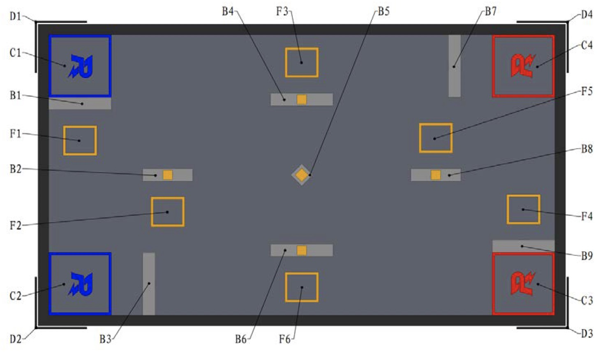

# 参数格式说明

许多参数使用数组表示，需要对应的引索才能知道每位代表什么，这是此手册存在的意义

注意：`kernal`和`rmaics`的参数命名方式不完全相同

|rmaics|kernal|含义|
|-|-|-|
|[state](#state)||总状态|
|[agents](#agents)|[cars](#agents)|车的状态|
|[buff](#buff)|[buff_info](#buff)|Buff信息（F1～F6对应buff内容，以及是否已被使用）|
|[detect](#detect)|[detect](#detect)|激光雷达能检测到的车|
|[vision](#vision)|[vision](#vision)|摄像头能看到的车|
|[actions](#actions)|[orders](#actions)|控制车的指令|
|[g_map](#g_map)|[g_map](#g_map)|地图信息|
|[start_areas](#start_areas)|[start_areas]((#start_areas))|起始区域信息|
|[buff_areas](#buff_areas)|[buff_areas](#buff_areas)|buff区域信息|
|[barriers](#barriers)|[barriers](#barriers)|障碍物信息|
||[acts](#acts)|更底层的动作|

## state

`state`为自定义的类，定义如下：

```python
class state(object):
    def __init__(self, time, agents, buff_info, done=False,  detect=None, vision=None):
        self.time = time
        self.agents = agents
        self.buff = buff_info
        self.done = done
        self.detect = detect
        self.vision = vision
```

|名称|类型|范围|解释|
|---|---|---|---|
|time|int|0~180|比赛剩余时间|
|[agents](#agents)|float|array|车的状态|
|[buff](#buff)|int|array|比赛信息|
|done|bool|0~1|比赛是否结束|
|[detect](#detect)|int|array|能检测到哪些车|
|[vision](#vision)|int|array|能看到那些车|

## agents

`agents`描述机器人的状态，在`kernal`中用`cars`表述，是一个二维数组(numpy.array)，类型为`float`，`shape`为（car_mun，16），`car_num`为机器人的数量，表中的类型为理论类型，实际由数组整体类型决定，单个机器人的状态格式如下：

|引索|名称|类型|范围|解释|
|---|---|---|---|---|
|0|owner|int|0~1|队伍，0：红方，1：蓝方|
|1|x|float|0~808|x坐标[0]|
|2|y|float|0~448|y坐标|
|3|angle|float|-180~180|底盘绝对角度[1]|
|4|yaw|float|-90~90|云台相对底盘角度|
|5|heat|int|0~|枪口热度|
|6|hp|int|0~2000|血量|
|7|punish_time|int|0~2000|禁止移动/禁止射击剩余时间[2]，需10s|
|8|punish_state|Int|0~2|0：未受到惩罚，1：禁止射击，2：禁止移动|
|9|can_shoot|bool|0~1|决策频率高于出弹最高频率（10Hz）|
|10|bullet|int|0~|剩余子弹量|
|11|last_attacked_armor|int|0~4|最近1s内收到攻击的装甲板编号；0:前，1:右，2:后，3:左，4:无|
|12|wheel_hit|int|0~|轮子撞墙的次数|
|13|armor_hit|int|0~|装甲板撞墙的次数|
|14|car_hit|int|0~|轮子或装甲板撞车的次数|
|15|time_since_last_attacked|Int|0~|距离最近一次被击中的时间|

[0] 以车的起始角落为原点，并使地图的全部落在正半轴

[1] 原点与上相同，极轴落在x轴正方向，向y轴正方向旋转的方向为正

[2] 以epoch为单位计算，200epoch=1s

## buff

`buff`指buff信息，在`kernal`中用`buff_info`表示，二维数组，类型为`int`，所有参数理论类型也为`int`，`shape`为（6，2），具体如下：

* 索引0的（0～5）依次对应加成区/惩罚区（F1～F6）

* 索引1的（0～1）分别对应buff内容和该区域buff的激活状态
  * buff内容为int，范围0～5；0:蓝HP，1:蓝子弹，2:红HP，3:红子弹，4:禁止射击，5:禁止移动
  * buff的激活状态为int，范围0～1；0:已使用，1:未使用

## detect&vision

### detect

### vision

`detect`指激光雷达能看到的车，`vision`指摄像头能看到的车，两者均用二维数组表示，`shape`为：（car_num, car_num），比如

```python
#          0  1  2  3
detect = [[0, 1, 0, 0], # 0
          [0, 0, 1, 1], # 1
          [0, 0, 0, 0], # 2
          [1, 0, 0, 0]] # 3
```

表示：

0号车能检测到1号车

1号车能检测到2号车和3号车

2号车检测不到任何车

3号车能检测到0号车

## actions

`actions`为传给机器人的指令，在`kernal`中称作`orders`，二维数组，类型为`int`，所有参数理论类型也为`int`，`shape`为（car_num，7），单个指令格式如下

|引索|名称|范围|解释|手控按键|
|-|-|-|-|-|
|0|x|-1~1|-1：后退，0：不动，1：前进[3]|s/w|
|1|y|-1~1|-1：左移，0：不动，1：右移|q/e|
|2|rotate|-1~1|底盘，-1：左转，0：不动，1：右转|a/d|
|3|yaw|-1~1|云台，-1：左转，0：不动，1：右转|b/m|
|4|shoot|0~1|是否射击，0：否，1：是|space|
|5|shoot_mode|0~1|射击模式，0：单发，1：连发|r|
|6|auto_aim|0~1|是否启用自瞄，0：否，1：是|n|

[3] 会不断加速，x最大速度3m/s，y最大速度2m/s，实际上可以把这些按键理解为油门，控制是否加速

`串行多玩家模式`：可通过按键盘上方的数字改变操作对象，具体请参考[operation.md](./operation.md)

## g_map

`g_map`是`game_map`的缩写，为自定义的类，定义如下

```python
class g_map(object):
    def __init__(self, length, width, start_areas, buff_areas, barriers):
        self.length = length
        self.width = width
        self.start_areas = start_areas
        self.buff_areas = buff_areas
        self.barriers = barriers
```

|名称|类型|范围|解释|
|---|---|---|---|
|length|int|808|地图长度|
|width|int|448|地图宽度|
|[start_areas](#start_areas)|float|array|起始区域的位置信息|
|[buff_areas](#buff_areas)|float|array|F1~F5的位置信息|
|[barriers](#barriers)|float|array|障碍物的位置信息|

## areas&barriers

单个区域或障碍物的格式如下

|引索|名称|范围|解释|
|---|---|---|---|
|0|border_x0|0~808|左边界|
|1|border_x1|0~808|右边界|
|2|border_y0|0~448|上边界|
|3|border_y1|0~448|下边界|

以地图左上角为原点

### start_areas

`start_areas`为三维数组，`shape`为（2，2，4）

|引索0|引索1|名称|类型|队伍|
|-|-|-|-|-|
|0|0|start0|起始区|红方|
|0|1|start1|起始区|红方|
|1|0|start0|起始区|蓝方|
|1|1|start1|起始区|蓝方|

### buff_areas

`buff_areas`为二维数组，`shape`为（6，4）, 索引0～5依次对应F1～F6的位置坐标

### barriers

`barriers`为二维数组，`shape`为（9，4）, 索引0～8依次对应B1～B9的位置坐标

## acts

这个`acts`是`kernal`里的动作，与`rmaics`里的[`actions`](#actions)不同，本`acts`是一个较底层的action，类型`float`，`shape`为：（car_num，7）

|引索1|名称|解释|
|-|-|-|
|0|rotate_speed|底盘旋转速度|
|1|yaw_speed|云台旋转速度|
|2|x_speed|前进后退速度|
|3|y_speed|左右平移速度|
|4|shoot|是否发射|
|5|shoot_mutiple|是否连发|
|6|auto_aim|是否自动瞄准|
